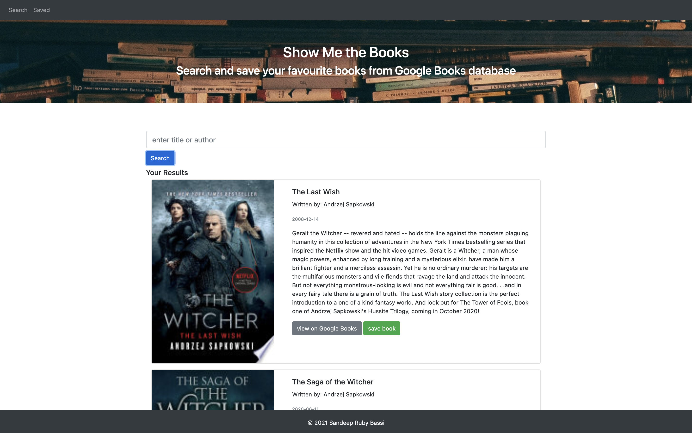
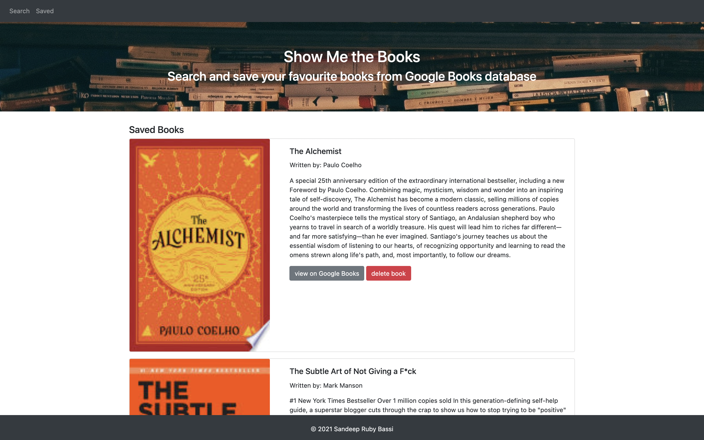

 

# Show Me the Books

## Description
A simple Google Book search application using React, Node, Express and Mongoose (MERN).

The application allows the user to search authors and book titles which are fecthed from Google Books API. 

App Summary:
* Search page - user can search for books via the Google Books API and render them here. User has the option to "View" a book, bringing them to the book on Google Books, or "Save" a book, saving it to the Mongo database.

* Saved page - renders all books saved to the Mongo database. User has an option to "View" the book, bringing them to the book on Google Books, or "Delete" a book, removing it from the Mongo database.

## Table of Contents
- [Preview](#Preview)
- [Execute](#Execute)
- [Contributing](#Contributing)
- [License](#License)
- [Environment](#Environment)
- [Questions](#Questions)

## Preview

> Visit the deployed application on [Heroku](https://showmethebooksapp.herokuapp.com/).

#### Search Page

#### Saved Page

## Execute
Clone the repo and in the command line run `npm install` or shortcut `npm i` to download all the npm package dependancies which include: Node Express and Mongoose.

Then invoke the application with command `npm run start`.

## Contributing
Contributions are welcomed.

## License
MIT

## Environment
* [Visual Studio Code](https://code.visualstudio.com/)
* [Git](https://git-scm.com/book/en/v2/Getting-Started-Installing-Git)
* [Node.js](https://nodejs.org/en/)
* [NPM](https://www.npmjs.com/)
* [React](https://reactjs.org/)
* [React Boostrap](https://react-bootstrap.github.io/)
* [React Developer Tools](https://chrome.google.com/webstore/detail/react-developer-tools/fmkadmapgofadopljbjfkapdkoienihi?hl=en)
* MongoDB Atlas